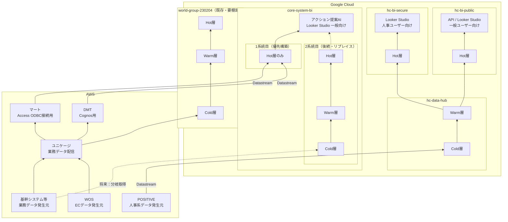

# bi-diagram



↓中村さんが書いてくださったフローチャート
```
flowchart BT

  %% ===== 左側：AWS =====
  subgraph AWS["AWS / As-Is"]
    direction TB
    Core["基幹システム等（生データ）"]
    Unikage["ユニケージ（旧）"]
    Core --> Unikage
  end


  %% ===== 中央：GCP Phase2 =====
  subgraph GCP["Google Cloud / Phase2 (本命リプレイス)"]
    direction LR

    subgraph core-system-bi["core-system-bi"]
      direction LR
      P2_Cold["Cold（Raw Ingest）"]
      P2_Warm["Warm（業務定義確定）<br/>売上・原価・粗利・返品等<br/>= SSOT"]
      P2_Gold["Hot（表示最適化）<br/>日次/週次/期間軸<br/>YoY/MoM/WoW<br/>ワイドテーブル"]
      P2_Out["Looker Studio / API（一般向け）"]

      P2_Cold --> P2_Warm
      P2_Warm --> P2_Gold
      P2_Gold --> P2_Out
    end
  end


  %% ===== AWS → GCP フロー =====
  Core -->|CDC / Extract| P2_Cold
  Unikage -.->|"段階的に停止"| P2_Cold
```
