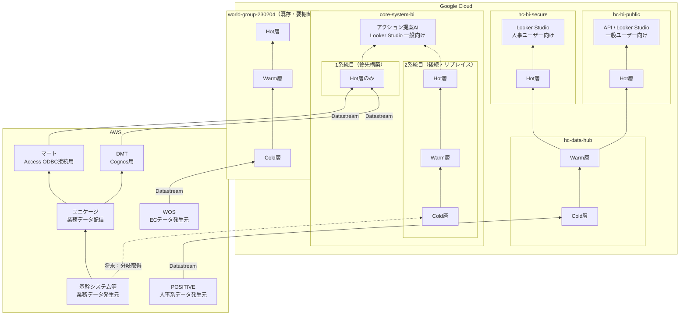

# bi-diagram

```mermaid
flowchart BT
    subgraph AWS["AWS"]
        direction LR
        Core["基幹システム等<br/>業務データ発生元"]
        POSITIVE["POSITIVE<br/>人事系データ発生元"]
        Unikage["ユニケージ<br/>業務データ配信"]
        Mart["マート<br/>Access ODBC接続用"]
        DMT["DMT<br/>Cognos用"]
        WOS["WOS<br/>ECデータ発生元"]
        
        Core --> Unikage
        Unikage --> Mart
        Unikage --> DMT
    end

    subgraph GCP["Google Cloud"]
        direction TB
        
        subgraph hc-data-hub["hc-data-hub"]
            DH_Cold["Cold層"]
            DH_Warm["Warm層"]
            DH_Cold --> DH_Warm
        end

        subgraph hc-bi-public["hc-bi-public"]
            PUB_Hot["Hot層"]
            PUB_Out["API / Looker Studio<br/>一般ユーザー向け"]
            PUB_Hot --> PUB_Out
        end

        subgraph hc-bi-secure["hc-bi-secure"]
            SEC_Hot["Hot層"]
            SEC_Out["Looker Studio<br/>人事ユーザー向け"]
            SEC_Hot --> SEC_Out
        end

        subgraph core-system-bi["core-system-bi"]
            direction TB
            subgraph Stream1["1系統目（優先構築）"]
                S1_Hot["Hot層のみ"]
            end
            subgraph Stream2["2系統目（後続・リプレイス）"]
                S2_Cold["Cold層"]
                S2_Warm["Warm層"]
                S2_Hot["Hot層"]
                S2_Cold --> S2_Warm --> S2_Hot
            end
            CORE_Out["アクション提案AI<br/>Looker Studio 一般向け"]
            S1_Hot --> CORE_Out
            S2_Hot -.-> CORE_Out
        end

        subgraph world-group["world-group-230204（既存・要棚卸）"]
            WG_Cold["Cold層"]
            WG_Warm["Warm層"]
            WG_Hot["Hot層"]
            WG_Cold --> WG_Warm --> WG_Hot
        end
    end

    %% データフロー（AWS → GCP）
    POSITIVE -->|Datastream| DH_Cold
    DH_Warm --> PUB_Hot
    DH_Warm --> SEC_Hot
    Mart -->|Datastream| S1_Hot
    DMT -->|Datastream| S1_Hot
    Core -.->|将来：分岐取得| S2_Cold
    WOS -->|Datastream| WG_Cold
```
